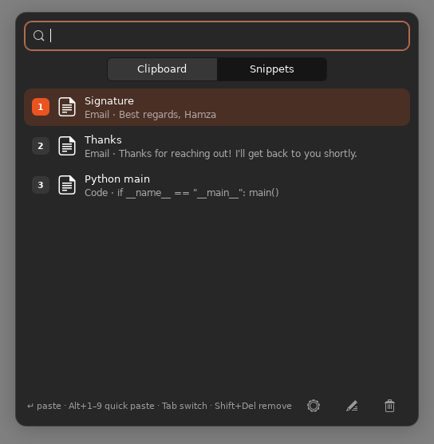
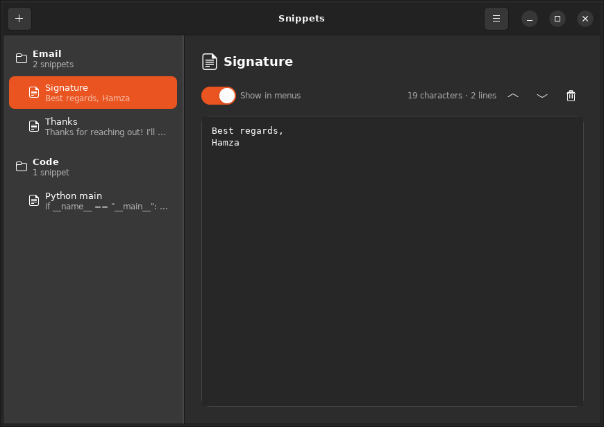
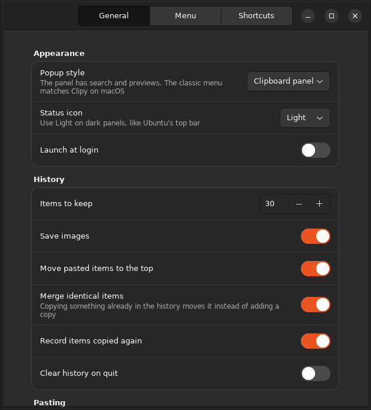

<div align="center">
  

  <h3>Clipboard history and snippets for macOS and Ubuntu</h3>

  [](https://github.com/Hamzanael/Clipy-ubuntu/actions/workflows/linux.yml)
  [](https://github.com/Hamzanael/Clipy-ubuntu/actions/workflows/CI.yml)
  
  [](./LICENSE)

  <p>
    <a href="#ubuntu--linux">Ubuntu</a> ·
    <a href="#macos">macOS</a> ·
    <a href="#features">Features</a> ·
    <a href="#keyboard-shortcuts">Shortcuts</a> ·
    <a href="#building-from-source">Build</a> ·
    <a href="#contributing">Contributing</a>
  </p>
</div>

---

**Clipy** keeps a history of everything you copy and lets you paste any of it again
in two keystrokes. Keep text you reuse often, such as signatures, addresses and code, as
**snippets**. This repository is a fork of [Clipy](https://github.com/Clipy/Clipy)
that adds a **native Ubuntu / Linux version** next to the original macOS app.

<p align="center">
  
  
</p>
<p align="center"><sub>The clipboard panel on Ubuntu 24.04 with the Yaru light and dark themes.</sub></p>

## Features

|                                                   | macOS | Ubuntu / Linux |
|---------------------------------------------------|:-----:|:--------------:|
| Clipboard history (text and images)               |   ✅   |       ✅        |
| Popup menu with numbered items and folders        |   ✅   |       ✅        |
| Searchable clipboard panel with previews          |   —   |       ✅        |
| Snippets in folders, with an editor               |   ✅   |       ✅        |
| Snippet import and export (same XML format)       |   ✅   |       ✅        |
| Automatic paste into the focused app              |   ✅   |       ✅        |
| Global keyboard shortcuts                         |   ✅   |       ✅        |
| Menu bar / tray icon                              |   ✅   |       ✅        |
| Skips passwords from password managers            |   ✅   |       ✅        |
| Launch at login                                   |   ✅   |       ✅        |
| Light and dark themes                             |   ✅   |       ✅        |

Snippets exported on one platform import on the other, so you can keep the same
snippets on a Mac and an Ubuntu machine.

## Ubuntu / Linux

The Linux version lives in [`linux/`](./linux). It is written in Python with GTK 3
and works on **Ubuntu 22.04 and 24.04**. It should also work on other GNOME-based
distributions.

### Install

```sh
git clone https://github.com/Hamzanael/Clipy-ubuntu.git
cd Clipy-ubuntu/linux
./install.sh --deps      # installs the required apt packages (asks for sudo), then Clipy
```

Then start **Clipy** from the app grid, or run `clipy-ubuntu`. It runs in the
tray. Press <kbd>Ctrl</kbd>+<kbd>Alt</kbd>+<kbd>V</kbd> anywhere to open your
clipboard.

> [!NOTE]
> **Using Wayland?** It is the default session on Ubuntu, and it doesn't let
> apps register global shortcuts. Run this once to add Clipy's shortcuts to
> GNOME's keyboard settings:
> ```sh
> clipy-ubuntu-shortcuts
> ```

To uninstall, run `./install.sh --uninstall`. This keeps your history and snippets.

### Screenshots

<table>
  <tr>
    <td align="center"><br><sub>Type to search. Press Enter to paste</sub></td>
    <td align="center"><br><sub>Snippets are one Tab away</sub></td>
  </tr>
  <tr>
    <td align="center"><br><sub>Snippet editor</sub></td>
    <td align="center"><br><sub>…in dark mode</sub></td>
  </tr>
  <tr>
    <td align="center"><br><sub>Preferences</sub></td>
    <td align="center"><br><sub>Preferences in dark mode</sub></td>
  </tr>
</table>

For Wayland details, auto-paste in terminals, where data is stored and more, see
**[linux/README.md](./linux/README.md)**.

## macOS

__Requirement__: macOS 13 Ventura or later

The macOS app is the original Clipy. Download it from
<https://clipy-app.com>, or [build it from source](#macos-app) below.

## Keyboard shortcuts

| Action                 | Ubuntu default                                   | macOS default                                  |
|------------------------|--------------------------------------------------|------------------------------------------------|
| Open clipboard / menu  | <kbd>Ctrl</kbd>+<kbd>Alt</kbd>+<kbd>V</kbd>      | <kbd>⌘</kbd>+<kbd>⇧</kbd>+<kbd>V</kbd>         |
| Open history           | <kbd>Ctrl</kbd>+<kbd>Alt</kbd>+<kbd>H</kbd>      | <kbd>⌘</kbd>+<kbd>Ctrl</kbd>+<kbd>V</kbd>      |
| Open snippets          | <kbd>Ctrl</kbd>+<kbd>Alt</kbd>+<kbd>B</kbd>      | <kbd>⌘</kbd>+<kbd>⇧</kbd>+<kbd>B</kbd>         |

You can change all of these in Preferences. The Ubuntu defaults avoid
<kbd>Ctrl</kbd>+<kbd>Shift</kbd>+<kbd>V</kbd>, which is paste in the terminal.

In the Ubuntu clipboard panel:

| Key | Action |
|-----|--------|
| Type | Search history and snippets |
| <kbd>↑</kbd> <kbd>↓</kbd> then <kbd>Enter</kbd> | Paste the selected item |
| <kbd>Alt</kbd>+<kbd>1</kbd> … <kbd>9</kbd> | Paste item 1–9 |
| <kbd>Tab</kbd> | Switch between Clipboard and Snippets |
| <kbd>Shift</kbd>+<kbd>Delete</kbd> | Remove the selected item from history |
| <kbd>Esc</kbd> | Clear the search, or close the panel |

## Building from source

### Linux version

```sh
cd linux
./bin/clipy-ubuntu                                   # run without installing
python3 -m unittest discover -s tests -t .           # unit tests
xvfb-run -a python3 -m unittest discover -s tests -t .   # also run the GTK window tests
```

See [linux/README.md](./linux/README.md#development) for an overview of the code.

### macOS app

Development environment: macOS 26 Tahoe, Xcode 26.5.

macOS checks Accessibility permission by the app's code signature. If Clipy is
built without a stable signing certificate, macOS may ask for Accessibility
permission again for every build.

For this reason, the default signing settings use the Clipy signing certificate.
Only the maintainer has this certificate, so local builds need to switch to
ad-hoc signing first:

1. Open `Clipy.xcodeproj` in Xcode.
2. Switch to ad-hoc build mode:
    1. Open `Configurations/CodeSigning.xcconfig`.
    2. Uncomment `#include "Configurations/CodeSigning-AdHoc.xcconfig"`.
3. Build the `Clipy` scheme.

If you want to use Firebase features, place your own `GoogleService-Info.plist`
in `Clipy/GoogleService`. Local builds without Firebase don't need this file.

## Repository layout

```
Clipy/            macOS app (Swift, AppKit)
ClipyTests/       macOS tests
linux/            Ubuntu / Linux app (Python, GTK 3)
  clipy_linux/      application code
  data/             icons, desktop entry, stylesheet
  docs/             screenshots
  tests/            unit and GTK smoke tests
  install.sh        per-user installer
```

## Contributing

Issues and pull requests are welcome, for both the Linux and the macOS app. The
Linux version especially needs:

- Testing on other desktops and distributions (KDE, Fedora, Mint, …)
- Better Wayland support
- Translations

For macOS localization, see the upstream
[CONTRIBUTING.md](https://github.com/Clipy/Clipy/blob/master/.github/CONTRIBUTING.md).

## Privacy

Your clipboard history and snippets stay on your computer. The **Linux version**
doesn't connect to the network at all. It has no analytics, crash reporting or
update checks. It stores its data in `~/.local/share/clipy` and
`~/.config/clipy`. For the **macOS app**, see [PRIVACY.md](./PRIVACY.md).

## Distribution

The original Clipy authors ask that anyone distributing derived work,
especially in the Mac App Store, follow two rules:

1. Don't use `Clipy` and `ClipMenu` as your product name.
2. Follow the MIT license terms.

## License

Clipy is available under the MIT license. See [LICENSE](./LICENSE) for more
info. Icons are copyrighted by their respective authors.

## Credits

- The [Clipy Project](https://github.com/Clipy/Clipy) made the original macOS
  app. Support them on [Open Collective](https://opencollective.com/clipy).
- Thank you to [@naotaka](https://github.com/naotaka), who published
  [ClipMenu](https://github.com/naotaka/ClipMenu) as open source.
