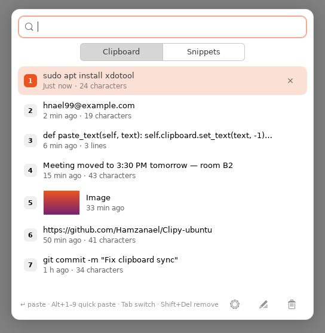
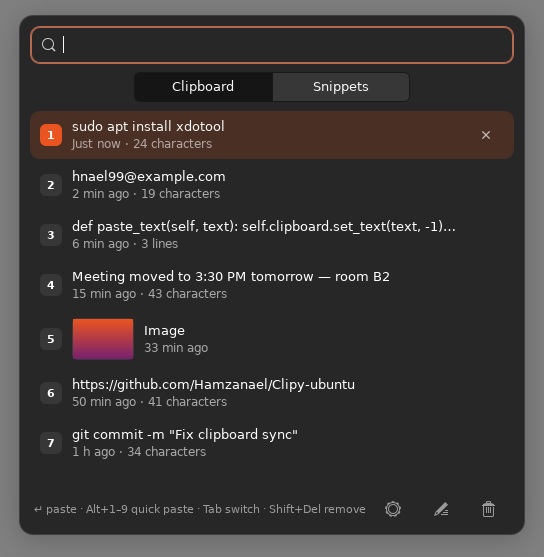
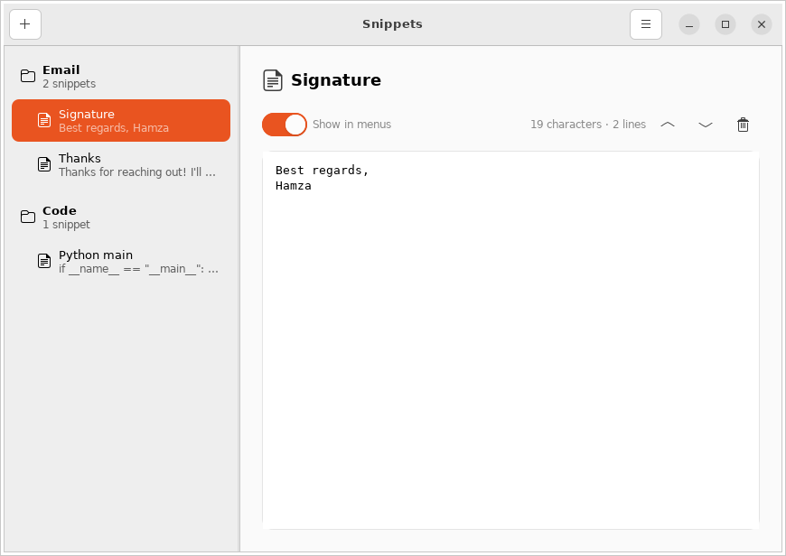
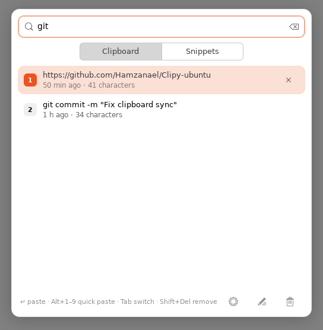
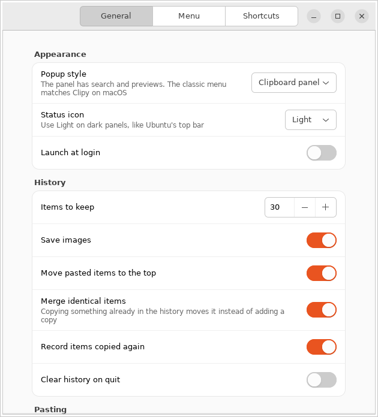

# Clipy for Ubuntu / Linux

A port of Clipy to Linux desktops, built with Python 3 and GTK 3. It lives next
to the macOS app and uses the same menu layout, settings and snippet XML format.

Tested on Ubuntu 22.04 and 24.04 (GNOME). It should also work on other
distributions and desktops that have GTK 3 and a system tray.

<p align="center">
  
  
</p>

## Features

- A **clipboard panel** that opens at the mouse pointer. Type to search your
  history and snippets, then press Enter to paste. It shows image thumbnails
  and when each item was copied, and follows the system's light or dark theme
- Clipboard history for text and images
- The **classic Clipy menu** is still available (Preferences → Popup style). It works
  as on macOS: the newest items inline, the rest in numbered folders
  (`1 - 10`, `11 - 20`, …). Press an item's number key to choose it
- Snippets organized in folders, with an editor. Snippets are imported and
  exported in the macOS Clipy XML format, so you can move them between Mac and Linux
- Automatic paste into the focused app after you choose an item
- Main, History and Snippet popup menus opened with global shortcuts
- Tray icon (AppIndicator), launch at login, and a preferences window
- Skips passwords that password managers mark as secret (KeePassXC and others)

## Install

```sh
git clone https://github.com/Hamzanael/Clipy-ubuntu.git
cd Clipy-ubuntu/linux
./install.sh --deps      # installs the apt packages below (asks for sudo), then Clipy
clipy-ubuntu             # or launch "Clipy" from the app grid
```

`install.sh` installs Clipy for your user only, into `~/.local`. To install
the dependencies yourself instead, run:

```sh
sudo apt install python3-gi gir1.2-gtk-3.0 gir1.2-ayatanaappindicator3-0.1 \
                 gir1.2-keybinder-3.0 xdotool
```

On stock Ubuntu GNOME the tray icon is shown by the preinstalled "Ubuntu
AppIndicators" extension. On other GNOME installs, add the "AppIndicator and
KStatusNotifierItem Support" extension.

To uninstall, run `./install.sh --uninstall`. This keeps your history and snippets.

Run `./install.sh --check` to see what is installed, what is missing and whether
Clipy is running. It exits with 0 when everything is ready. AI coding agents
can follow [`AGENTS.md`](../AGENTS.md) to install Clipy for you.

You can also run Clipy from the checkout without installing it: `linux/bin/clipy-ubuntu`.

<p align="center">
  
</p>
<p align="center">
  
  
</p>

## Shortcuts

| Menu     | Default shortcut |
|----------|------------------|
| Main     | Ctrl+Alt+V       |
| History  | Ctrl+Alt+H       |
| Snippets | Ctrl+Alt+B       |

Keys in the clipboard panel:

| Key                | Action                                  |
|--------------------|-----------------------------------------|
| Type               | Search history and snippets             |
| ↑ / ↓, Enter       | Select and paste                        |
| Alt+1 … Alt+9      | Paste item 1–9                          |
| Tab                | Switch between Clipboard and Snippets   |
| Shift+Delete       | Remove the selected history item        |
| Esc                | Clear the search, or close the panel    |

**Ubuntu on Xorg (X11):** Clipy registers these shortcuts itself. Change them under
Preferences → Shortcuts.

**Ubuntu on Wayland (the default since 22.04):** Wayland does not let apps
register global shortcuts. Run this once to add them as GNOME custom shortcuts:

```sh
clipy-ubuntu-shortcuts            # add; `--remove` removes them
```

They then appear in Settings → Keyboard → Custom Shortcuts, where you can change
them. Each shortcut runs a command, and you can bind these in any desktop:

```sh
clipy-ubuntu --menu main      # or: history, snippet
clipy-ubuntu --snippets       # open the snippet editor
clipy-ubuntu --preferences
clipy-ubuntu --clear-history
clipy-ubuntu --quit
```

## Wayland notes

On Wayland, GTK 3 apps only see the clipboard while they have focus. For that
reason Clipy runs through XWayland (`GDK_BACKEND=x11`), which lets it watch the
clipboard in the background on GNOME. Set `CLIPY_ALLOW_WAYLAND=1` to turn this off.

Automatic paste works by simulating a key press:

- **X11:** `xdotool` (installed by `--deps`).
- **Wayland:** `wtype` on wlroots compositors (Sway, Hyprland), or `ydotool`
  with its `ydotoold` daemon running. GNOME's Wayland session does not allow
  `wtype`, so there you need `ydotool`. Otherwise Clipy copies the item and you
  press Ctrl+V yourself. `xdotool` still reaches apps that run under XWayland.

Terminals paste with Ctrl+Shift+V. Change "Paste keystroke" in Preferences to
`ctrl+shift+v`, or to `shift+insert`, which works in most apps.

## Where data is stored

- Settings: `~/.config/clipy/settings.json`
- History and snippets: `~/.local/share/clipy/clipy.db` (SQLite)

## Development

```sh
cd linux
python3 -m unittest discover -s tests -t .
```

The modules that don't use GTK (`storage`, `menu_model`, `snippets_xml`,
`panel_model`, `paste`, `config`) are unit tested without a display. `app.py`,
`panel.py`, `snippet_editor.py` and `preferences.py` hold the GTK code, and
`data/style.css` holds the styling. It uses the GTK theme's colours, so it
works with Yaru, Adwaita and dark themes.
